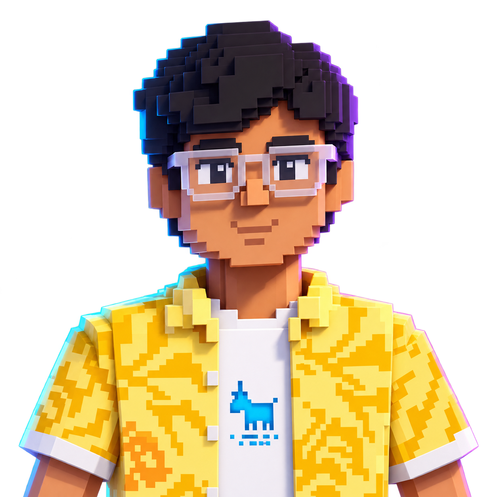

<div align="center">




<br />


### Building dependable backends, practical AI workflows, and systems that turn ideas into products.

<a href="https://udaibatta.github.io/udai-portfolio/">
  
</a>
<a href="https://linkedin.com/in/udai-batta">
  
</a>
<a href="mailto:udbatta@gmail.com">
  
</a>

</div>

## `> whoami`

```yaml
name: Udai Batta
education: BE @ Thapar Institute of Engineering & Technology
focus: Backend engineering, AI workflows, trading systems
currently_learning: System design, async Python, Redis, PostgreSQL
location: Patiala, Punjab, India
```

## `> toolkit`

<div align="center">


</div>

## `> featured_projects`

<div align="center">

<a href="https://github.com/UdaiBatta/LedgerLens">
  
</a>
<a href="https://github.com/UdaiBatta/monika-eng-CRM">
  
</a>
<a href="https://github.com/UdaiBatta/API-automation-testing">
  
</a>

<br />

<a href="https://github.com/UdaiBatta/monika-engineers">
  
</a>
<a href="https://github.com/UdaiBatta/sign_language_detector">
  
</a>
<a href="https://github.com/UdaiBatta/udai-portfolio">
  
</a>

<br /><br />

<sub>More builds: <a href="https://github.com/UdaiBatta/CLI-Binance-Bot">CLI Binance Bot</a> - <a href="https://github.com/UdaiBatta/ArchiAI">ArchiAI</a> - <a href="https://github.com/UdaiBatta/Skylearn-LMS">Skylearn LMS</a> - <a href="https://github.com/UdaiBatta/FLUNKER-Django-social-media">FLUNKER</a></sub>

</div>

## `> telemetry`

<div align="center">


&nbsp;


<br /><br />


</div>

<div align="center">

### Want the full story behind the work?

<a href="https://udaibatta.github.io/udai-portfolio/">
  
</a>

</div>

## `> contribution_snake`

<picture>
  <source media="(prefers-color-scheme: dark)" srcset="https://raw.githubusercontent.com/UdaiBatta/UdaiBatta/output/github-contribution-grid-snake-dark.svg" />
  <source media="(prefers-color-scheme: light)" srcset="https://raw.githubusercontent.com/UdaiBatta/UdaiBatta/output/github-contribution-grid-snake.svg" />
  
</picture>

<div align="center">

<sub>Generated daily with <a href="https://github.com/marketplace/actions/generate-snake-game-from-github-contribution-grid">Platane/snk</a></sub>

<br /><br />


</div>
